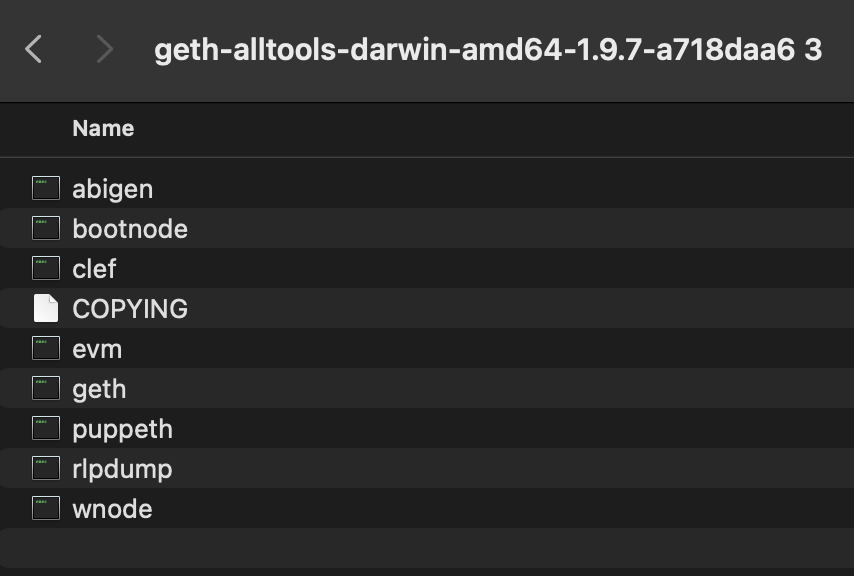
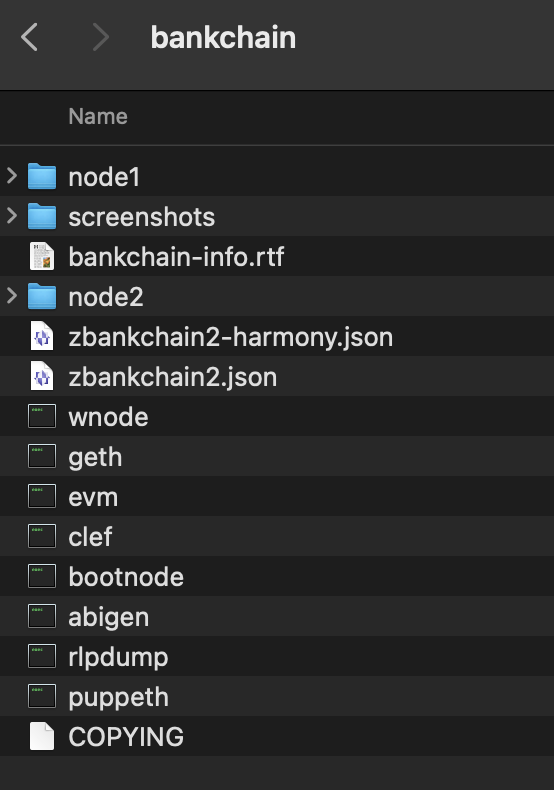
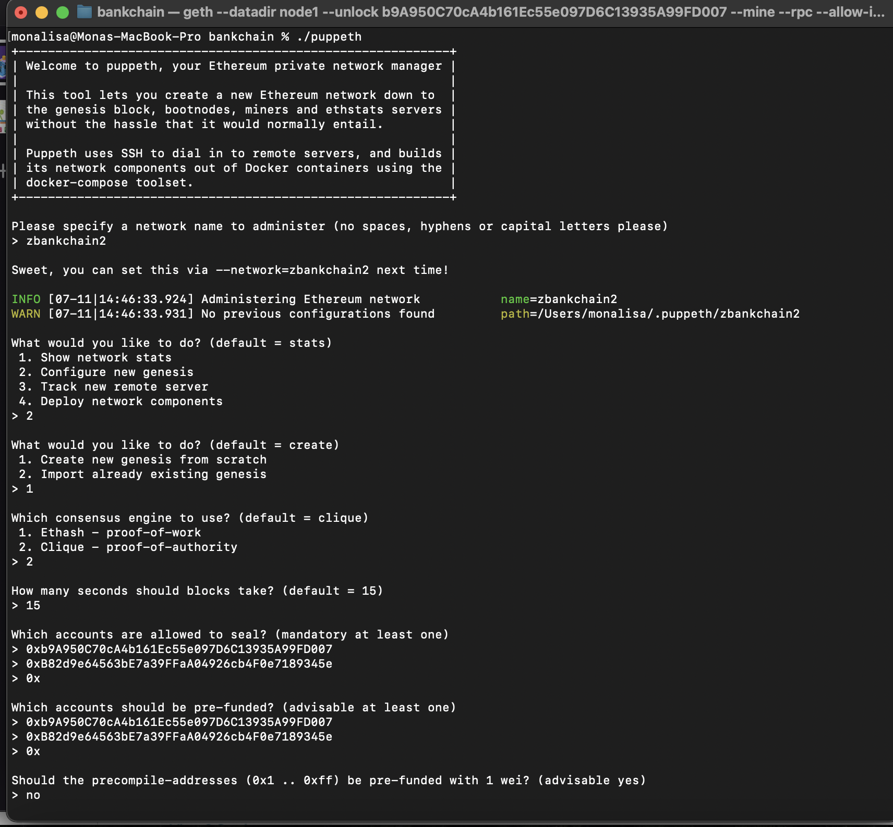
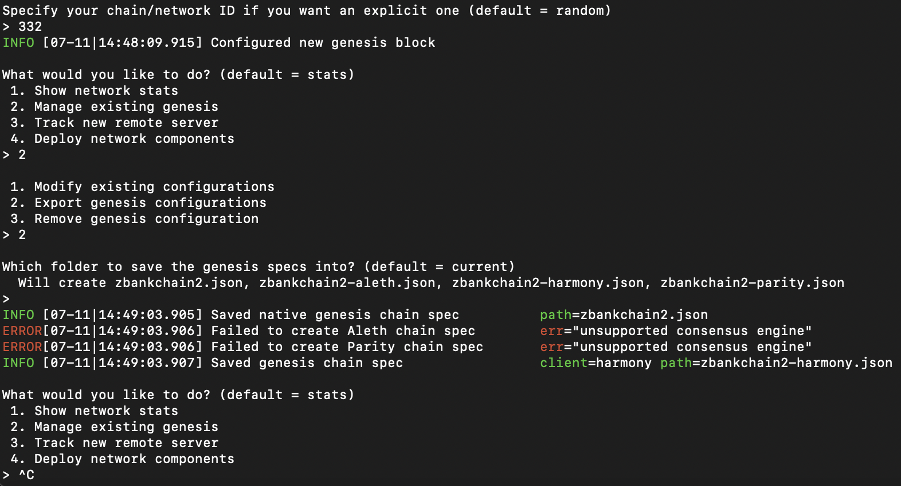
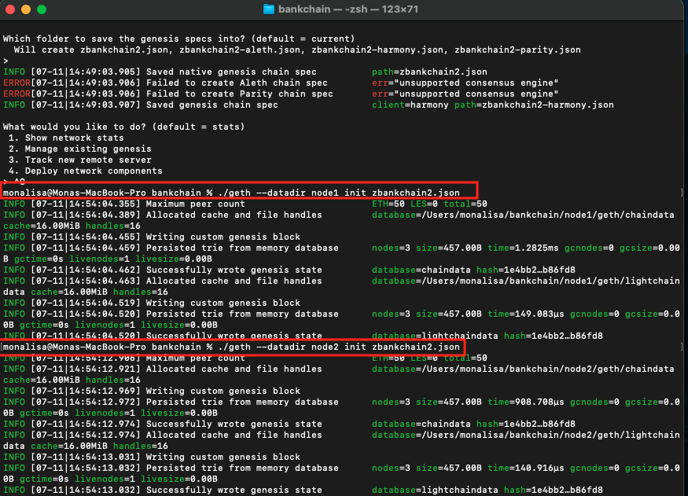
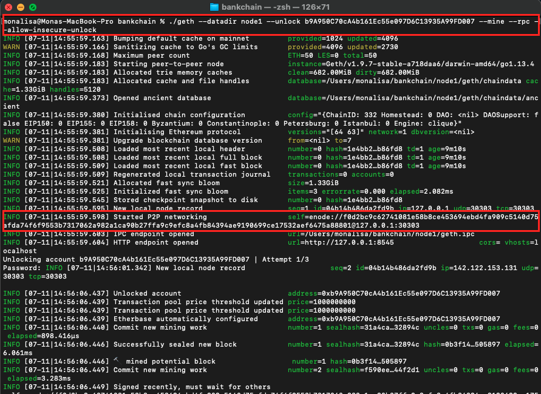
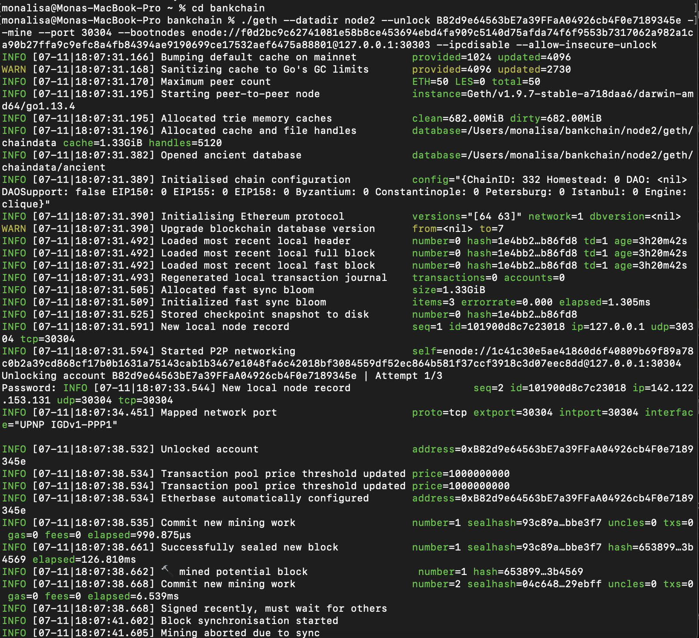
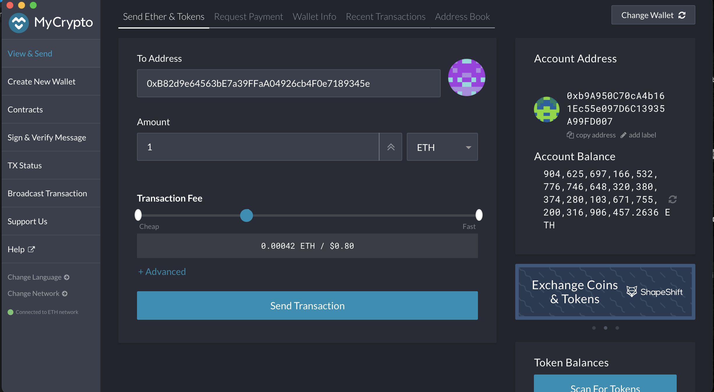
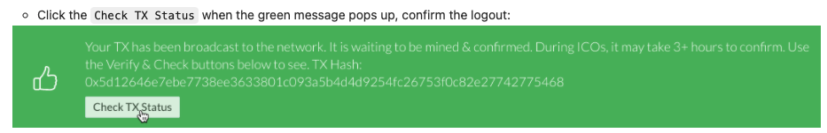
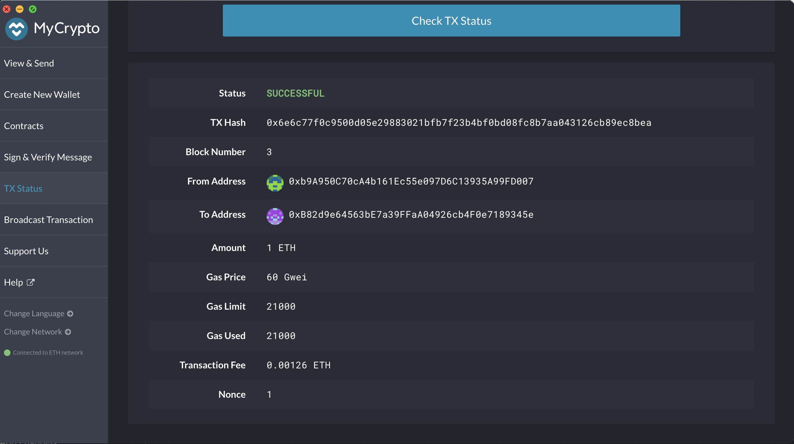

# Zbank Blockchain

## Steps to Setting Up Test Proof of Authority Blockchain

1. Download Geth and Tools from  https://geth.ethereum.org/downloads/ and choose version 1.9.7.

2. Once download is completed, decompress files and save to a desired working folder directory. 



Save the files above to "bankchain" folder.



3. Create accounts for two nodes on the network with a separate datadir for each using geth.

```
./geth --datadir node1 account new
./geth --datadir node2 account new
```
Copy the Node 1 & 2 public address onto a text file to be used later.


4. Open terminal and run puppeth in terminal to configure the test blockchain in the bankchain folder.

```
./puppeth
```
Complete blockchain configuration by steps in the screen shot below.




5. After configuring the genesis block, we can now initialize the nodes with the genesis json file with the following command. 

```
./geth --datadir node1 init networkname.json
./geth --datadir node1 init networkname.json
```

*****Change the name of the json file to your own network json file**



6. With the two nodes initialized, they can now begin mining blocks. Use the commands below to start Node 1 & 2.

NODE 1:
```
./geth --datadir node1 --unlock b9A950C70cA4b161Ec55e097D6C13935A99FD007 --mine --rpc --allow-insecure-unlock
```


NODE 2:

In a separate terminal window start Node 2 using the command below.

```
./geth --datadir node2 --unlock B82d9e64563bE7a39FFaA04926cb4F0e7189345e --mine --port 30304 --bootnodes enode://f0d2bc9c62741081e58b8ce453694ebd4fa909c5140d75afda74f6f9553b7317062a982a1ca90b27ffa9c9efc8a4fb84394ae9190699ce17532aef6475a88801@127.0.0.1:30303 --ipcdisable --allow-insecure-unlock
```
Refer to the screen shot below for clarification.




7. After starting the two nodes we can now open the MyCrypto app to add our custom zbankchain.


8. We can test our custom zbankchain network by sending some ETH between the two accounts that we've created. First, we need to sign into our account on Mycrypto using our Node 1 Keystore file and entering the corresponding password.


9. On the left menu, click on view & send to paste in our Node 2 address to send an arbitrary amount of ETH.



10. After sending we can click on check TX status to see if it was succefully sent.



11. If done correctly, the transaction should go from pending to successful.

